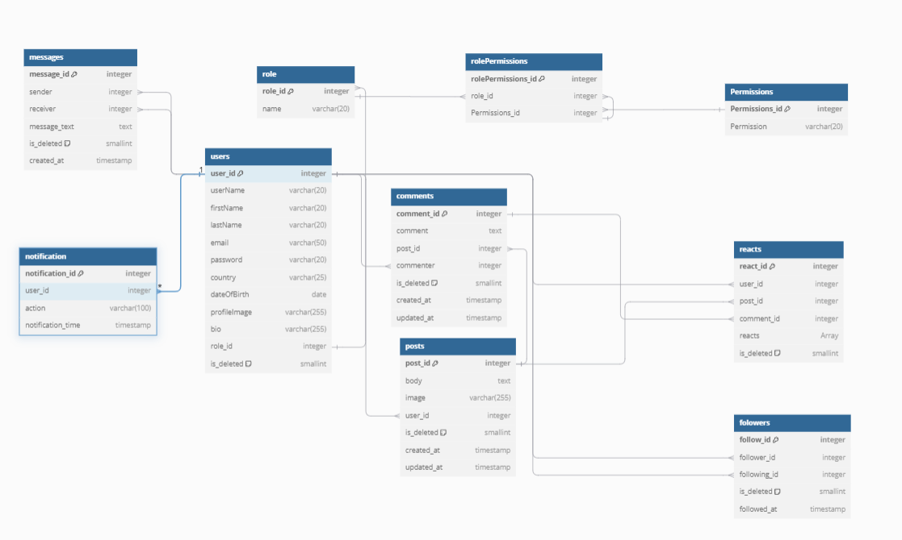

<p align="center">

 
 
</p>

<h3 align="center">MOLTAQA
</h3>

---

<p align="center"> Social Media Platform
    <br> 
<!-- <a href=''>Demo</a> -->
    <br> 
</p>

## 📝 Table of Contents

- [About](#about)
- [Getting Started](#getting_started)
- [Usage](#usage)
- [Built Using](#built_using)
- [User Story](#user_story)
- [Data Flow](#data_flow)
- [Guided By](#guided_by)

## 🧐 About <a name = "about"></a>

Write about 1-2 paragraphs describing the purpose of your project.

In This Application You Can Contact With Any Person Using MOLTAQA And Talk About Your Opinions By Creating Posts Or Comments, Also You Can Follow Any User And See His Activities , Thank You For Choosing Us.

## 🏁 Getting Started <a name = "getting_started"></a>

These instructions will get you a copy of the project up and running on your local machine for development and testing purposes.

### Prerequisites

- Visual Studio Code follow this <a href='https://code.visualstudio.com/download'>link</a> to install.
- Git Bash follow this <a href='https://git-scm.com/downloads'>link</a> to install.
- postgresql follow this <a href='https://www.postgresql.org/download/'>link</a> to install.
- Node.js follow this <a href='https://nodejs.org/en/download/prebuilt-installer/current'>link</a> to install.

### Installing:

1. Clone the repo to your local machine using git bash.

```
git clone https://github.com/MansafCoderz/MERAKI_Academy_Project_5.git
```

2. Install packeges repeat this step in backend and frontend folder

```
npm i
```

3. Run server using git bash inside backend folder

```
npm run dev
```

4. Run application using git bash inside frontend folder

```
npm run dev
```

Now app ready to use

## 🎈 Usage <a name="usage"></a>


- You have to create account by register page then login with it 
- When you login you will navigate to home page and you can start by creating your own posts ,
- You can follow users by clicking on explore button in navbar or search bar and see they activities .
- Also you can chatting with users that you followed them and talk with them about your opinions
- You can adding reacts to any post by (like button , creating comments) Also you can save any of thoose posts
- You have full access to edit on your own profile and controll it in any time you want
- You can cotact with us directly by clicking on setting then contact us and we will be so habby while listening your feedbacks
- For extra informations you can read about how to use this app by clicking setting Button then how to use this app
- thanks for your time and we hope to live an exceptional experience
## ⛏️ Built Using <a name = "built_using"></a>

- [postgresql](https://www.postgresql.org/download) - Database
- [Express JS](https://expressjs.com/) - Server Framework
- [React JS](https://https://reactjs.org/) - Web Framework
- [Node JS](https://nodejs.org/en/) - Server Environment
- [Ant Design](https://ant.design/) - Style Framework
- [Redux](https://redux.js.org/) - JS Library 
- [socket io](https://socket.io/) - Real Time Library
- [Email JS](https://www.emailjs.com/) - JS Library 
- [cloudinary](https://cloudinary.com/) - Cloud Based Service
## User Story <a name = "#user_story"></a>


<a href='https://trello.com/b/54oM5x7R/mansaf-coderz'>Trello</a>

## Data Flow <a name = "#data_flow"></a>

</a>

## ⚠️ Guided By <a name = "guided_by"></a>

This project is guided by ©️ **[Mansaf Coderz]**
